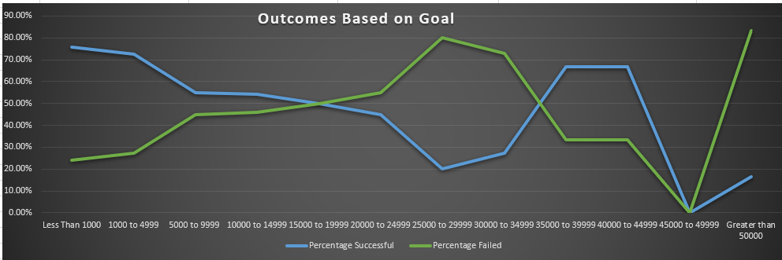
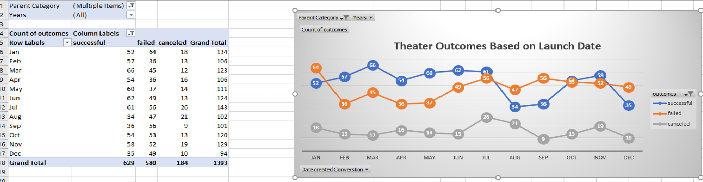
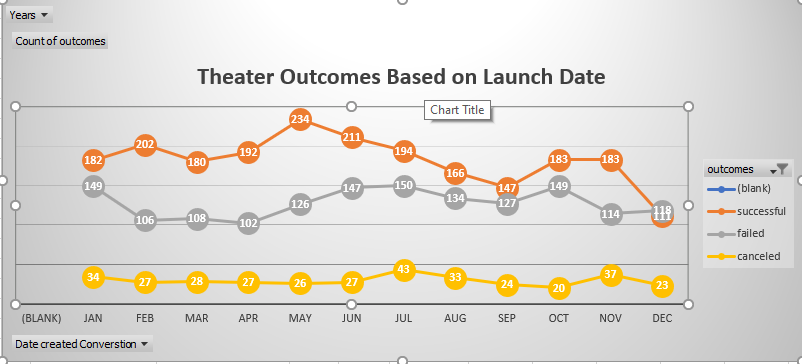
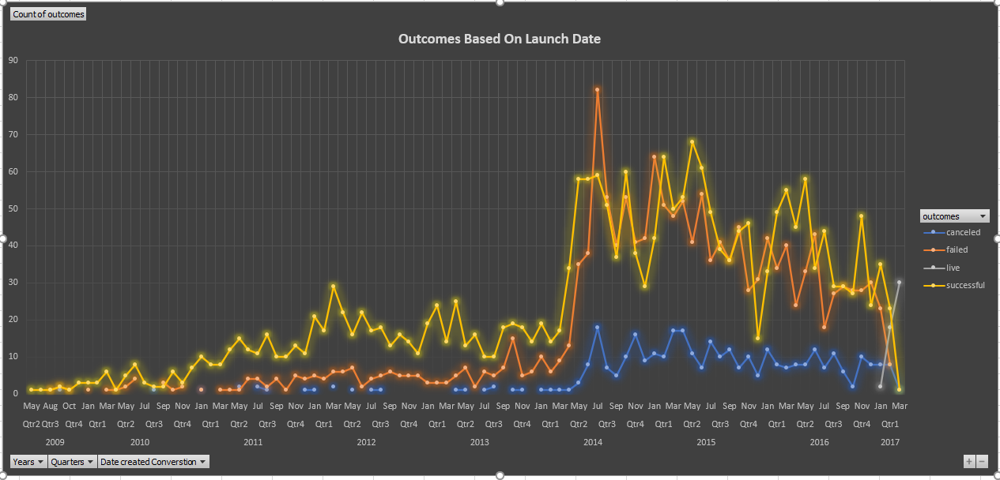

# Kickstarter-analysis
An Analysis of Kickstarter Campaigns.
This data is a series of information that was analytically isolated to give a clearer picture of the best
 way Louise should run her funding campaign to have a more effiecient result for her theater. The kickstarter campaign analysis
 will assist in uncovering hidden trends in the theator industry and crowdfunding outcomes. 
The analytical review created several recomendations such as: Planning Launching times and places, as they directly corelate with crowdfunding results. We recommended to have a goal that is in the median of past successful crowdfunding campaigns in order to have a higher pledge ratio and ultimately a successful campaign. 
As you can see by taking a look at the outcomes below we can see the Outcomes of Goals, and best dates to launch 

Best Launch Date 

Best Lauch Date by Theater

Best Launch date outcomes

